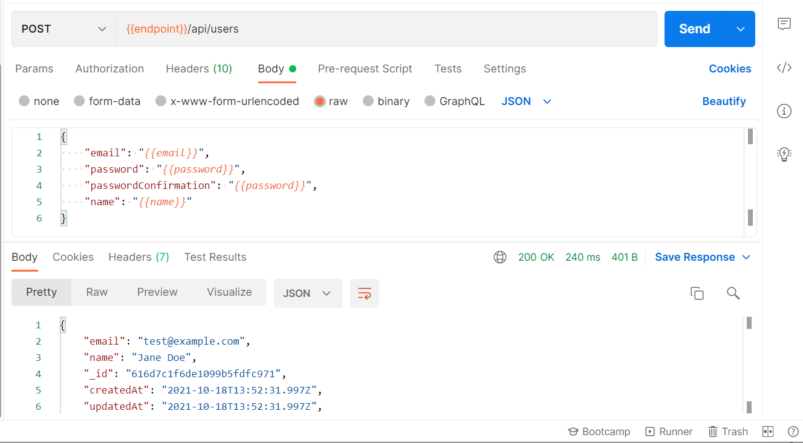

# :zap: Node MongoDB Zod

* Node.js + Express used with the [zod library](https://github.com/colinhacks/zod) to interract with a MongoDB database
* **Note:** to open web links in a new window use: _ctrl+click on link_


## :page_facing_up: Table of contents

* [General info](#general-info)
* [Screenshots](#screenshots)
* [Technologies](#technologies)
* [Setup](#setup)
* [Features](#features)
* [Status](#status)
* [Inspiration](#inspiration)
* [Contact](#contact)

## :books: General info

* Controllers: One for each resource: product, session and user
* Middleware: there are three - to deserialize user, require user & validate resource
* Models: one for each resource: product, session and user
* Schema: used by validate resource middleware
* Utils: utilities for connection to the database, jwt & logger
* Data flow: HTTP endpoint <-> ( Middleware ) <-> Controller <-> Service <-> Database
* [mongoose v6](https://mongoosejs.com/docs/migrating_to_6.html) legacy type HookNextFunction has been removed
* [mongoose queries with the lean option](https://mongoosejs.com/docs/tutorials/lean.html) used to get results faster
* [lodash omit](https://lodash.com/docs/4.17.15#omit) used to return a copy of the object minus the filtered item - user password in this case
* [zod library](https://github.com/colinhacks/zod) used for data validation with automatic typing, as the code uses typescript data types

## :camera: Screenshots



## :signal_strength: Technologies

* [Node.js v14](https://nodejs.org/) Javascript runtime using the [Chrome V8 engine](https://v8.dev/)
* [Express v4](https://www.npmjs.com/package/express) web framework for node
* [MongoDB Atlas](https://www.mongodb.com/es/cloud/atlas) cloud database service
* [mongoose v6](https://mongoosejs.com/) mongodb object modelling for node.js
* [pino v7](https://www.npmjs.com/package/pino) very low overhead Node.js logger.
* [dayjs v1](https://www.npmjs.com/package/dayjs) minimalist JavaScript library that parses, validates, manipulates & displays dates and times
* [zod v3](https://www.npmjs.com/package/zod) TypeScript-first schema declaration and validation library. A schema can be any data type
* [JWT tokens](https://jwt.io/) using RS256 algorithm
* [nanoid](https://www.npmjs.com/package/nanoid) A tiny (130bytes), fast (2x faster than UUID), secure, URL-friendly, unique string ID generator for JavaScript. ID size is only 21 symbols

## :floppy_disk: Setup

* `npm i` to install dependencies
* Create `.env` and add database credentials - see `.example.env`
* Create public & private keys using [JWT](https://jwt.io/) with the RS256 algorithm option selected. Take care with the format and the `-----END PRIVATE KEY----` etc. to avoid an "ERR_OSSL_PEM_BAD_END_LINE" error
* MongoDB has to be running - I used the cloud database MongoDB Atlas instead of installing MongoDB on my hard drive
* `yarn dev` or `npm run dev` runs app in the development mode with auto-restart.
* Open [http://localhost:5000](http://localhost:5000) to view it in the browser.

## :wrench: Testing

* Postman and Thunder Client used to simulate HTTP endpoints
* See `test.txt` for tests that have passed

## :computer: Code Examples

* Function to create new user to schema format; email, password, password confirmation & name strings

```typescript
export const createUserHandler = async (
  req: Request<{}, {}, CreateUserInput["body"]>,
  res: Response
) => {
  try {
    const user = await createUser(req.body);
    return res.send(user);
  } catch (err: any) {
    logger.error(err);
    return res.status(409).send(err.message);
  }
};
```

## :cool: Features

* [Nano ID](https://www.npmjs.com/package/nanoid) id generator uses 21 symbols and is only 130bytes. 

## :clipboard: Status, Testing & To-Do List

* Status: Code complete and part tested
* To-Do: Complete testing using Thunder Client

## :clap: Inspiration

* [TomDoesTech: Build a REST API with Node.js, Express, TypeScript, MongoDB & Zod](https://www.youtube.com/watch?v=BWUi6BS9T5Y&t=198s)

## :file_folder: License

* N/A

## :envelope: Contact

* Repo created by [ABateman](https://github.com/AndrewJBateman), email: gomezbateman@yahoo.com